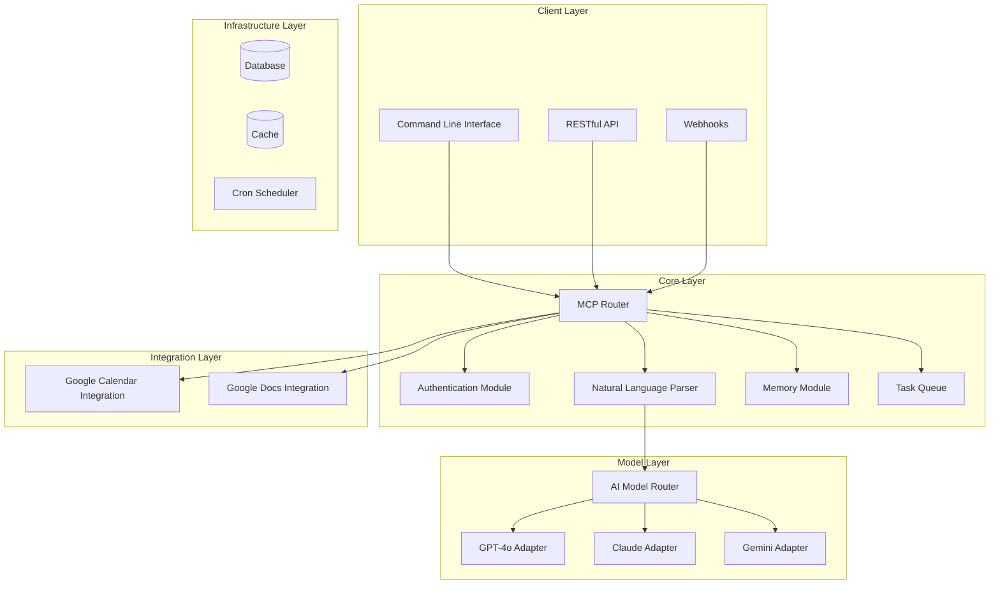

# Google Calendar MCP Server

**Your personal AI-powered assistant for Google Calendar and Google Docs.**

Google Calendar MCP is an open-source server that turns natural language into structured schedules and notes. Powered by modern LLMs and Model Control Protocol (MCP), it helps you plan, remember, and reflect—automatically.

---

## Features

- **Natural-language agenda parsing**  
  "Meet Sam for coffee at 2PM next Thursday" → Google Calendar event + reminders

- **Google Docs journaling**  
  "Write a weekly reflection every Sunday" → Auto-generated doc + timestamped entry

- **Reminders that work**  
  Auto-set reminders: 1 day and 1 hour before events (or customize your own)

- **Model-flexible (GPT, Claude, Gemini)**  
  Bring your own LLM and plug it in via adapters

- **Privacy-first**  
  Self-hostable with full control over your data and APIs

---

## Architecture Documentation

This repository contains comprehensive architecture documentation for the Google Calendar MCP server:

- [Architecture Overview](docs/architecture.md) - System architecture, components, and data flow
- [Technology Stack](docs/tech-stack.md) - Detailed technology recommendations and rationale
- [File Structure](docs/file-structure.md) - Recommended project organization
- [Module Details](docs/module-details.md) - Implementation guidance for core modules
- [Data Flows](docs/data-flows.md) - Sequence diagrams of key system interactions

## System Architecture

Google Calendar MCP follows a modular architecture with clear boundaries between components:



## Quick Start

### Prerequisites

- Node.js (v18 or higher)
- npm or yarn
- MongoDB (optional for local development)
- Redis (optional for local development)

### Installation

1. Clone the repository:
```bash
git clone https://github.com/yourusername/google-calendar-mcp-server.git
cd google-calendar-mcp-server
```

2. Install dependencies:
```bash
npm install
```

3. Set up environment variables:
```bash
cp .env.example .env
```
Edit the `.env` file with your specific settings.

4. Build the project:
```bash
npm run build
```

5. Start the server:
```bash
npm start
```

For development:
```bash
npm run dev
```

### OAuth Setup

1. Go to the [Google Cloud Console](https://console.cloud.google.com/)
2. Create a new project
3. Enable the Google Calendar API and Google Docs API
4. Set up OAuth consent screen
5. Create OAuth 2.0 credentials
6. Add the credentials to your `.env` file

## Technology Stack

- **Runtime**: Node.js with TypeScript
- **Framework**: Express.js
- **Database**: MongoDB
- **Cache**: Redis
- **Queue**: Bull
- **LLM Framework**: LangChain.js
- **Authentication**: OAuth2.0
- **Containerization**: Docker & Docker Compose

For more details on technology choices, see the [Technology Stack](docs/tech-stack.md) documentation.

## Development Roadmap

- [x] Architecture documentation
- [x] Initial project setup
- [ ] Core module implementation
- [ ] Google API integrations
- [ ] Model adapters
- [ ] Client interfaces
- [ ] Scheduler implementation
- [ ] Testing and security review
- [ ] Deployment guides

## Contributing

Contributions are welcome! Please read our [Contributing Guide](CONTRIBUTING.md) for details on our code of conduct and the process for submitting pull requests.

## License

This project is licensed under the MIT License - see the [LICENSE](LICENSE) file for details.
