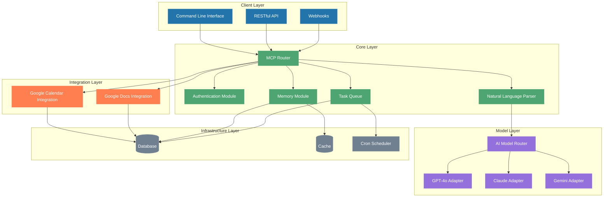

# AI Agenda MCP: System Architecture

## Overview

AI Agenda MCP is a modular server designed to connect natural language processing with Google services (Calendar and Docs) through the Model Control Protocol (MCP) framework. The system employs a layered architecture with clear boundaries between components, ensuring extensibility, maintainability, and security.

## Architecture Diagram

## Technology Stack

| Component Type | Recommended Technology | Rationale |
|----------------|------------------------|-----------|
| **Runtime Environment** | Node.js | Asynchronous I/O model, extensive package ecosystem, excellent for API servers |
| **Framework** | Express.js | Lightweight, flexible, widely-used web framework for Node.js |
| **Database** | MongoDB | Schema-flexible NoSQL database, ideal for evolving data structures |
| **Caching** | Redis | In-memory data store for fast access to frequently used data |
| **Authentication** | OAuth2.0 | Industry standard for secure API authorization |
| **Task Queue** | Bull | Redis-based queue for Node.js with scheduling capabilities |
| **AI Integration** | LangChain.js | Framework for composable LLM applications |
| **Testing** | Jest | Complete testing solution with mocking capabilities |
| **Logging** | Winston | Flexible logging library with multiple transports |
| **API Documentation** | OpenAPI/Swagger | Industry standard for API documentation |
| **Containerization** | Docker | Easy deployment and environment consistency |
| **Orchestration** | Docker Compose | Simple multi-container orchestration |

## Component Descriptions

### Client Layer

#### Command Line Interface (CLI)
- Provides a terminal-based interface for direct interaction with the system
- Supports natural language commands and formatted outputs
- Allows for batch processing and scripting

#### RESTful API
- HTTP-based interface for programmatic access
- JSON payload format for requests and responses
- Versioned endpoints with comprehensive documentation
- Authentication and rate limiting built-in

#### Webhooks
- Enables event-driven integration with external systems
- Supports customizable triggers and payloads
- Includes retry logic and delivery confirmation

### Core Layer

#### MCP Router
- Central routing mechanism for the Model Control Protocol
- Maps incoming requests to appropriate modules
- Enforces access controls and request validation
- Maintains session state across requests

#### Authentication Module
- Manages Google OAuth2.0 authentication flow
- Stores and refreshes access tokens securely
- Provides scoped access to Google services
- Implements role-based access control (RBAC)

#### Natural Language Parser
- Processes natural language inputs into structured commands
- Extracts entities, intents, and parameters
- Handles contextual queries with reference resolution
- Provides confidence scores for parsed interpretations

#### Memory Module
- Maintains user history and preferences
- Stores context for conversation continuity
- Implements forgetting curves for relevance decay
- Provides retrieval mechanisms for context-aware responses

#### Task Queue
- Manages asynchronous and scheduled tasks
- Implements priority-based execution
- Provides retry mechanisms with exponential backoff
- Supports monitoring and introspection

### Integration Layer

#### Google Calendar Integration
- Creates, updates, and queries calendar events
- Manages reminder settings and notifications
- Handles recurring events and exceptions
- Supports calendar sharing and permissions

#### Google Docs Integration
- Creates and updates documents with structured content
- Implements templates for consistent formatting
- Manages access permissions and sharing
- Tracks document history and version control

### Model Layer

#### AI Model Router
- Selects appropriate AI model based on request requirements
- Balances load across models for cost efficiency
- Falls back to alternative models during failures
- Standardizes inputs and outputs across model implementations

#### Model Adapters (GPT-4o, Claude, Gemini)
- Implements model-specific API interactions
- Normalizes responses to consistent formats
- Handles rate limiting and quota management
- Optimizes prompts for each model's capabilities

### Infrastructure Layer

#### Database
- Persists system state and user data
- Implements data access patterns for efficient queries
- Ensures data integrity and consistency
- Supports backups and disaster recovery

#### Cache
- Stores frequently accessed data for improved performance
- Implements time-to-live (TTL) policies for data freshness
- Reduces API calls to external services
- Optimizes memory usage with eviction policies

#### Cron Scheduler
- Executes recurring tasks at specified intervals
- Manages time zone awareness for scheduled events
- Handles daylight saving time transitions
- Provides audit trails for scheduled task execution

## Data Flow

1. **Request Ingestion**:
   - Client sends a natural language command through CLI, API, or webhook
   - Request is authenticated and validated by the Auth module
   - Router directs the request to the Natural Language Parser

2. **Command Processing**:
   - NLP module consults the Memory module for context and user preferences
   - NLP sends the enriched request to the Model Router
   - Appropriate AI model processes the request and returns structured data
   - Parser validates and normalizes the structured data

3. **Task Execution**:
   - Router dispatches commands to appropriate integration modules
   - Integration modules interact with Google APIs
   - Results are stored in the database and cache as appropriate
   - Asynchronous or scheduled tasks are placed in the Task Queue

4. **Response Delivery**:
   - Results are formatted according to the original request channel
   - Memory module is updated with new context
   - Response is delivered to the client
   - Follow-up tasks are scheduled if necessary

## Security Considerations

- **Data Encryption**: All data at rest and in transit is encrypted
- **Access Control**: Fine-grained permissions based on user roles
- **Token Management**: Secure handling of OAuth tokens with regular rotation
- **Input Validation**: Thorough validation of all inputs to prevent injection attacks
- **Rate Limiting**: Protection against abuse and DoS attacks
- **Audit Logging**: Comprehensive logging of all system activities for security analysis

## Scalability Approach

- **Horizontal Scaling**: Components designed to scale independently
- **Stateless Design**: Core services maintain minimal state for easy replication
- **Caching Strategy**: Multi-level caching to reduce computational load
- **Asynchronous Processing**: Non-blocking operations for improved throughput
- **Load Balancing**: Distribution of requests across service instances

## Fault Tolerance

- **Graceful Degradation**: System continues with reduced functionality during partial failures
- **Circuit Breaking**: Prevents cascading failures by isolating problematic services
- **Retry Policies**: Intelligent retry mechanisms with exponential backoff
- **Fallback Options**: Alternative execution paths when primary options fail
- **Health Monitoring**: Continuous system health checks with automated recovery

## Extensibility

- **Plugin Architecture**: Support for custom modules following defined interfaces
- **Event System**: Pub/sub mechanism for loose coupling between components
- **Configuration Driven**: Behavior adjustable through configuration rather than code changes
- **Versioned APIs**: Backward compatibility with clear upgrade paths
- **Feature Flags**: Controlled rollout of new capabilities