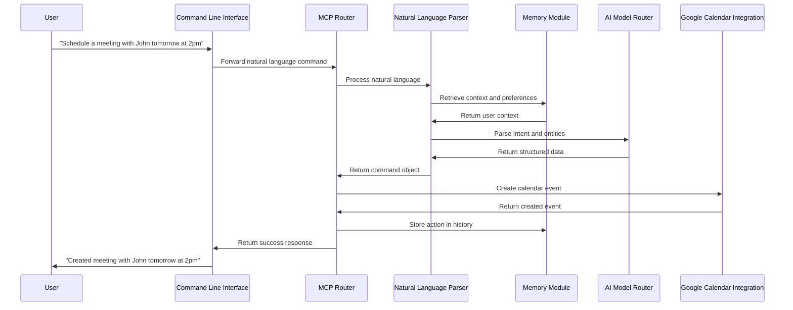
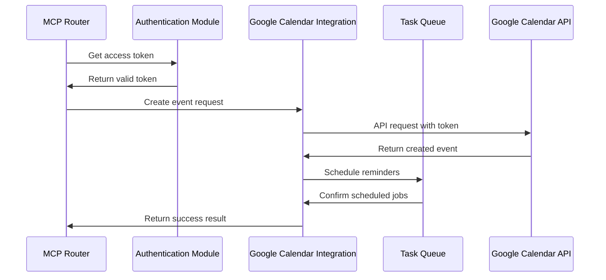
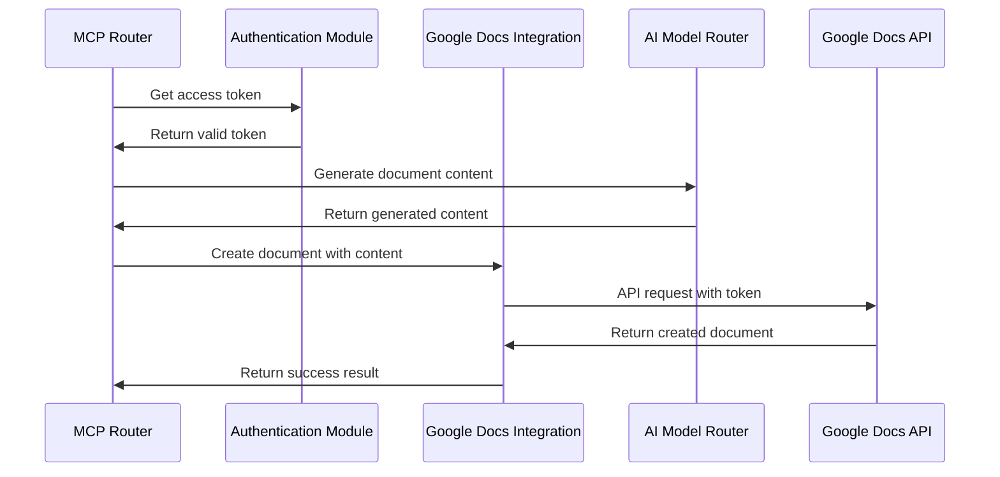
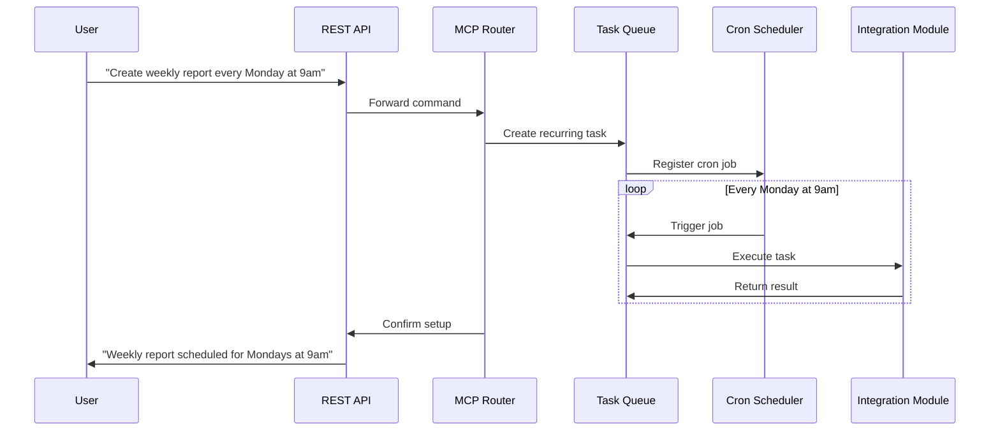
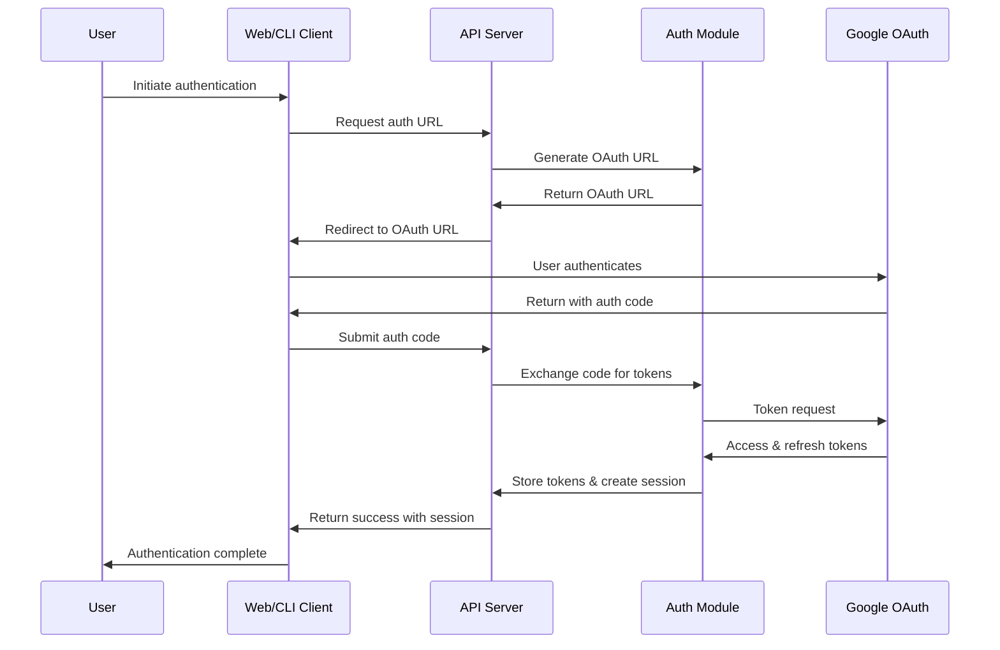
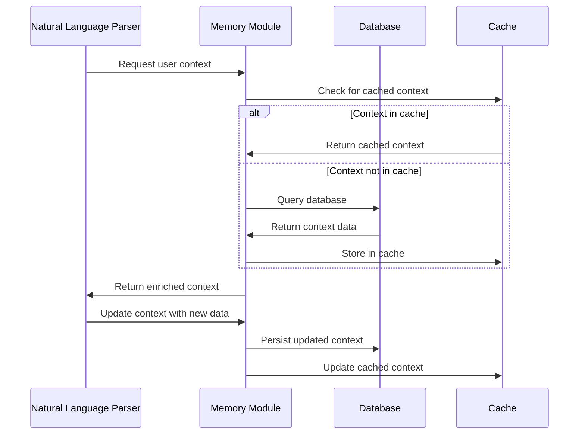
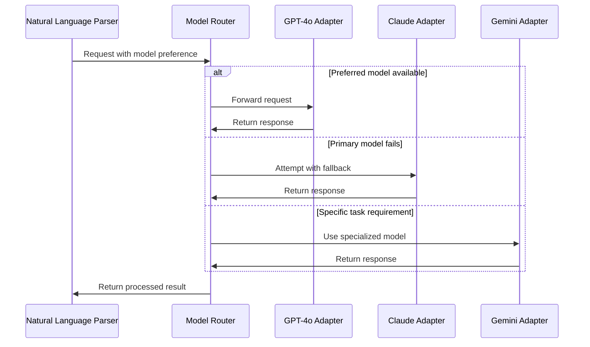
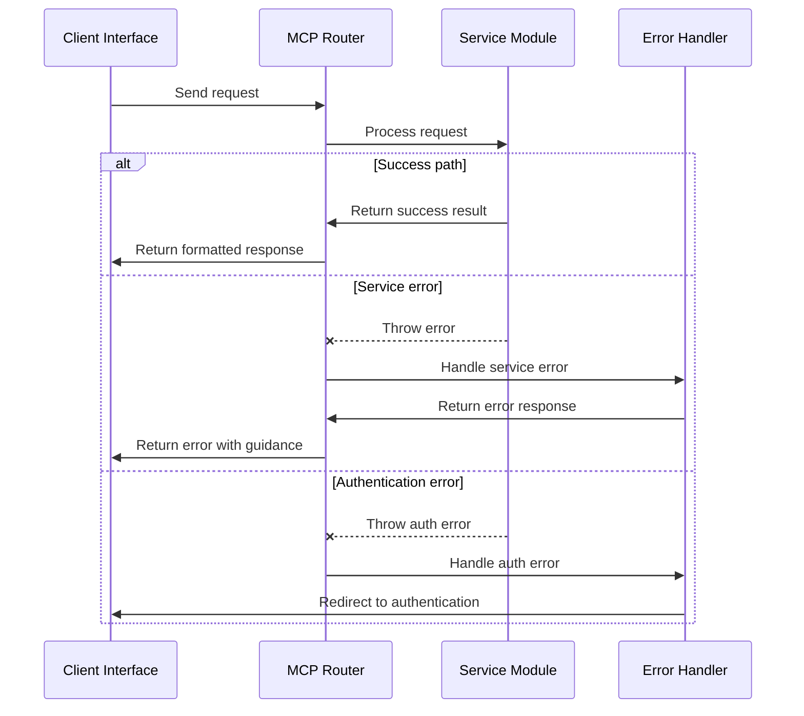
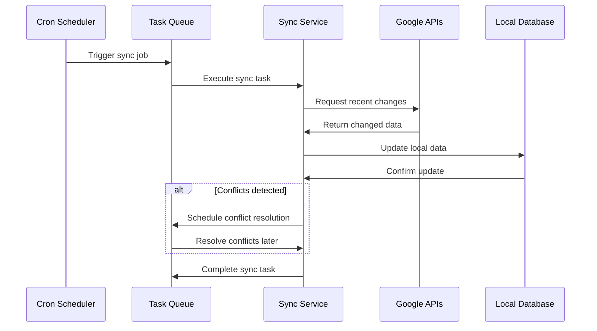

# AI Agenda MCP: Data Flows

This document illustrates the key data flows within the AI Agenda MCP system. Understanding these flows helps developers see how the different components interact during common operations.

## Natural Language Command Processing Flow

## Google Calendar Event Creation Flow

## Google Docs Creation Flow

## Recurring Task Flow

## Authentication Flow

## Memory and Context Flow

## Model Selection Flow

## Error Handling Flow

## Data Synchronization Flow

These diagrams illustrate the primary data flows within the system. They show how components interact during typical operations and help developers understand the system's behavior at runtime.